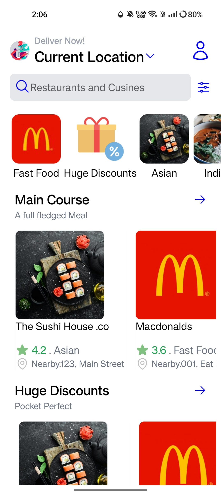
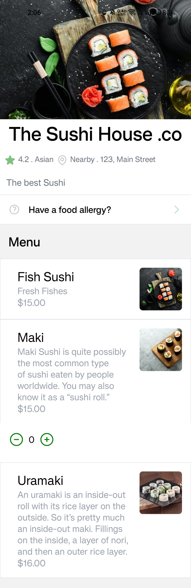
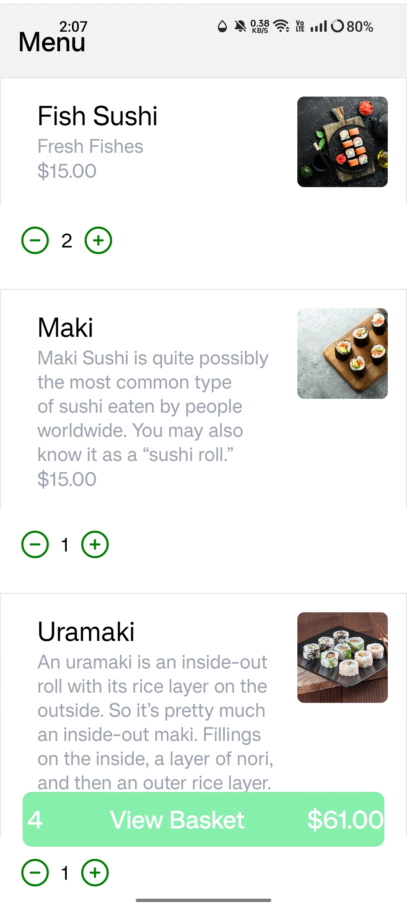
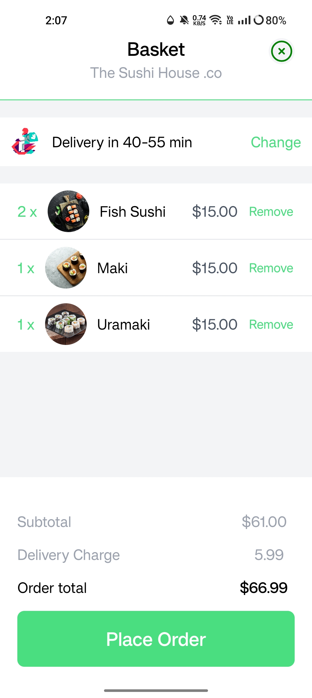
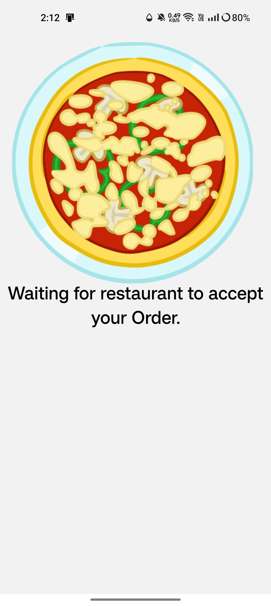

# Delivery App

This project is created by React Native ,Expo CLI, Redux Toolkit, Sanity.io and Tailwindcss along with NativeWind.

## Installation

Clone or Download the Repo
Open in Code Editor eg.VS Code
Install all the dependencies by running command (npm i)
start the project by (npm start) or (expo start)
cd into sanity folder and run the same command make sure to do this in separate terminal
start the sanity by (npm run dev) 

Connect to your device or emulator :)

# App Preview

## Acknowledgments

Thanks for visiting,feel free to have a chat about the application.
